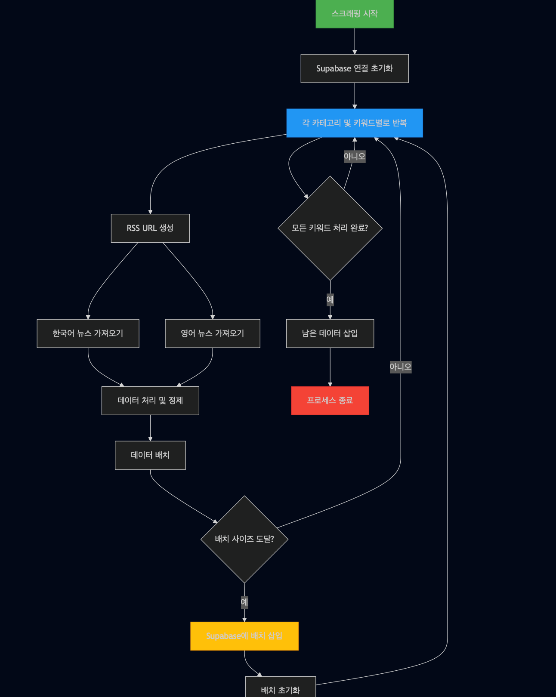

# Trend Box

> AI 및 기술 트렌드를 자동으로 수집, 분석하여 정기적으로 뉴스레터를 발송하는 프로젝트입니다.



## 📌 프로젝트 소개

Trend Box는 최신 AI 및 기술 동향을 자동으로 수집하고 분석하여 정기적으로 뉴스레터 형태로 제공하는 오픈소스 프로젝트입니다. 다양한 소스로부터 실시간으로 정보를 수집하고, 이를 분석하여 가치 있는 인사이트를 제공합니다.

## 🚀 주요 기능

- **자동화된 데이터 수집**
  - 다양한 키워드 기반의 RSS 피드 스크래핑
  - 한국어 및 영어 뉴스 동시 수집
  - 3시간마다 자동 업데이트

- **지능형 데이터 처리**
  - 중복 제거 및 데이터 정제
  - 카테고리별 분류
  - 트렌드 분석

- **정기 뉴스레터 발송**
  - 일일/주간 요약 리포트
  - 주요 트렌드 하이라이트
  - 구독자 맞춤형 컨텐츠

## 🛠 기술 스택

- **Backend**: Python 3.11
- **Database**: Supabase
- **Infra**: GitHub Actions
- **Deployment**: Serverless (GitHub Actions)

## 📂 프로젝트 구조

```
trend-box/
├── .github/workflows/  # GitHub Actions 워크플로우
│   └── scrapper.yml    # 자동화 스크립트 설정
├── rss-scrapper.py     # RSS 피드 스크래퍼
├── news_data_processor.py  # 뉴스 데이터 처리기
├── newsletter_sender.py    # 뉴스레터 발송 모듈
└── requirements.txt     # 파이썬 의존성 목록
```

## 🔧 시작하기

1. 저장소 클론
   ```bash
   git clone https://github.com/yourusername/trend-box.git
   cd trend-box
   ```

2. 의존성 설치
   ```bash
   pip install -r requirements.txt
   ```

3. 환경 변수 설정 (`.env` 파일 생성)
   ```
   SUPABASE_URL=your_supabase_url
   SUPABASE_KEY=your_supabase_key
   TOGETHER_API_KEY=your_together_api_key
   ```

## 🤝 기여하기

기여는 언제나 환영입니다! 이슈를 열거나 풀 리퀘스트를 보내주세요.

## 📄 라이선스

이 프로젝트는 [MIT 라이선스](LICENSE)를 따릅니다.